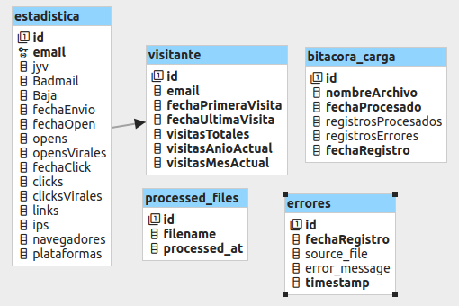

# VinkOS_Test
Prueba Desarrollo de VinkOS

## Esquema de Base de Datos

Este proyecto utiliza una base de datos MySQL para almacenar información sobre visitantes. A continuación se describe el esquema de la tabla `visitante`. Se muestra 


### Tabla `visitante`

La tabla `visitante` está definida con el siguiente esquema:

```sql
CREATE TABLE visitante (
    id INT AUTO_INCREMENT PRIMARY KEY,
    email VARCHAR(255) NOT NULL UNIQUE,
    fechaPrimeraVisita DATETIME NOT NULL,
    fechaUltimaVisita DATETIME NOT NULL,
    visitasTotales INT NOT NULL,
    visitasAnioActual INT NOT NULL,
    visitasMesActual INT NOT NULL,
    CONSTRAINT chk_fechaUltimaMayorFechaPrimera CHECK (fechaUltimaVisita >= fechaPrimeraVisita)
);

```

### Descripción de Campos

- **`id`**:
  - **Tipo**: `INT`
  - **Descripción**: Identificador único para cada visitante. Se incrementa automáticamente con cada nuevo registro.

- **`email`**:
  - **Tipo**: `VARCHAR(255)`
  - **Descripción**: Dirección de correo electrónico del visitante. Este campo es único y no puede ser nulo.

- **`fechaPrimeraVisita`**:
  - **Tipo**: `DATETIME`
  - **Descripción**: Fecha y hora de la primera visita del usuario. Este campo es obligatorio.

- **`fechaUltimaVisita`**:
  - **Tipo**: `DATETIME`
  - **Descripción**: Fecha y hora de la última visita del usuario. Este campo es obligatorio.

- **`visitasTotales`**:
  - **Tipo**: `INT`
  - **Descripción**: Número total de visitas realizadas por el usuario.

- **`visitasAnioActual`**:
  - **Tipo**: `INT`
  - **Descripción**: Número de visitas realizadas por el usuario en el año actual.

- **`visitasMesActual`**:
  - **Tipo**: `INT`
  - **Descripción**: Número de visitas realizadas por el usuario en el mes actual.

### Restricciones

- **`chk_fechaUltimaMayorFechaPrimera`**:
  - **Descripción**: Esta restricción garantiza que la `fechaUltimaVisita` no sea anterior a la `fechaPrimeraVisita`, asegurando la consistencia de los datos.


 ### Tabla `estadistica`

```sql
CREATE TABLE estadistica (
    id INT AUTO_INCREMENT PRIMARY KEY,
    email VARCHAR(255) NOT NULL,
    jyv BOOLEAN,
    Badmail BOOLEAN,
    Baja BOOLEAN,
    fechaEnvio DATETIME,
    fechaOpen DATETIME,
    opens INT,
    opensVirales INT,
    fechaClick DATETIME,
    clicks INT,
    clicksVirales INT,
    links INT,
    ips INT,
    navegadores VARCHAR(255),
    plataformas VARCHAR(255),
    CONSTRAINT fk_email_visitante FOREIGN KEY (email) REFERENCES visitante(email)
);
```

#### Descripción de Campos

- **`id`**:
  - **Tipo**: `INT`
  - **Descripción**: Identificador único para cada registro en la tabla de estadísticas. Se incrementa automáticamente con cada nuevo registro.

- **`email`**:
  - **Tipo**: `VARCHAR(255)`
  - **Descripción**: Dirección de correo electrónico del visitante. Este campo se usa como clave foránea que referencia al campo `email` de la tabla `visitante`.

- **`jyv`**:
  - **Tipo**: `BOOLEAN`
  - **Descripción**: Indicador de si el visitante ha realizado alguna acción relacionada con `jyv` (especificar según contexto del proyecto).

- **`Badmail`**:
  - **Tipo**: `BOOLEAN`
  - **Descripción**: Indicador de si el correo electrónico del visitante es considerado inválido o no deseado.

- **`Baja`**:
  - **Tipo**: `BOOLEAN`
  - **Descripción**: Indicador de si el visitante se ha dado de baja de alguna lista o servicio.

- **`fechaEnvio`**:
  - **Tipo**: `DATETIME`
  - **Descripción**: Fecha y hora en que se envió la información al visitante.

- **`fechaOpen`**:
  - **Tipo**: `DATETIME`
  - **Descripción**: Fecha y hora en que el visitante abrió la comunicación o contenido.

- **`opens`**:
  - **Tipo**: `INT`
  - **Descripción**: Número total de veces que el visitante ha abierto la comunicación o contenido.

- **`opensVirales`**:
  - **Tipo**: `INT`
  - **Descripción**: Número de veces que el contenido ha sido abierto de manera viral (compartido).

- **`fechaClick`**:
  - **Tipo**: `DATETIME`
  - **Descripción**: Fecha y hora en que el visitante hizo clic en un enlace dentro del contenido.

- **`clicks`**:
  - **Tipo**: `INT`
  - **Descripción**: Número total de clics realizados por el visitante en el contenido.

- **`clicksVirales`**:
  - **Tipo**: `INT`
  - **Descripción**: Número de clics realizados de manera viral (compartidos).

- **`links`**:
  - **Tipo**: `INT`
  - **Descripción**: Número de enlaces incluidos en la comunicación o contenido.

- **`ips`**:
  - **Tipo**: `VARCHAR(39)`
  - **Descripción**: Número de direcciones IP desde las cuales se ha accedido al contenido.

- **`navegadores`**:
  - **Tipo**: `VARCHAR(255)`
  - **Descripción**: Información sobre los navegadores utilizados por el visitante.

- **`plataformas`**:
  - **Tipo**: `VARCHAR(255)`
  - **Descripción**: Información sobre las plataformas (sistemas operativos) desde las cuales el visitante ha accedido al contenido.

#### Restricciones

- **`fk_email_visitante`**:
  - **Descripción**: Clave foránea que garantiza que el `email` en la tabla `estadistica` debe existir en la tabla `visitante`. Asegura la integridad referencial entre ambas tablas.


### Tabla `errores`

```sql
CREATE TABLE errores (
    id INT(11) AUTO_INCREMENT PRIMARY KEY,
    fechaRegistro TIMESTAMP DEFAULT CURRENT_TIMESTAMP,
    source_file VARCHAR(255) DEFAULT NULL,
    error_message TEXT DEFAULT NULL,
    timestamp TIMESTAMP DEFAULT CURRENT_TIMESTAMP
);
```

#### Descripción de Campos

- **`id`**:
  - **Tipo**: `INT(11)`
  - **Descripción**: Identificador único para cada registro en la tabla de errores. Se incrementa automáticamente con cada nuevo registro. Este campo es la clave primaria.

- **`fechaRegistro`**:
  - **Tipo**: `TIMESTAMP`
  - **Descripción**: Fecha y hora en que se registró el error. Tiene un valor por defecto de la fecha y hora actuales.

- **`source_file`**:
  - **Tipo**: `VARCHAR(255)`
  - **Descripción**: Nombre del archivo fuente asociado al error. Este campo puede ser `NULL`.

- **`error_message`**:
  - **Tipo**: `TEXT`
  - **Descripción**: Mensaje detallado del error. Este campo puede ser `NULL`.

- **`timestamp`**:
  - **Tipo**: `TIMESTAMP`
  - **Descripción**: Marca temporal de cuando se produjo el error. Tiene un valor por defecto de la fecha y hora actuales.

#### Restricciones

- **`PRIMARY KEY (id)`**:
  - **Descripción**: Clave primaria que asegura que cada registro en la tabla tiene un identificador único.


## Puntos de Control

### Carga de Archivos

- **Verificación de Existencia de Archivos**: Antes de iniciar la carga, se verifica si los archivos `.txt` están disponibles en la ubicación remota. Esto asegura que solo se procesen archivos existentes.
- **Control de Archivo Duplicado**: Implementación de mecanismos para evitar la carga repetida de archivos. Cada archivo se marca como procesado para evitar duplicaciones.

### Procesamiento de Datos

- **Integridad del Archivo**: Verificación del formato y la estructura de los archivos `.txt` para asegurar que cumplan con los requisitos esperados antes de su procesamiento.
- **Validación de Datos**: Los datos extraídos del archivo son validados para cumplir con el esquema de la base de datos, incluyendo la verificación de formatos de fecha y tipos de datos.

### Inserción en Base de Datos

- **Manejo de Errores de Inserción**: Captura y registro de errores durante la inserción de datos en las tablas. Se asegura que los registros erróneos no interrumpan el proceso de carga general.
- **Consistencia de Datos**: Verificación de la consistencia de los datos antes de la inserción. Se revisa que los datos cumplan con las restricciones de la base de datos.

### Respaldo y Archivos Procesados

- **Creación de Respaldo**: Los archivos procesados se archivan en un archivo ZIP para mantener un registro histórico y permitir la recuperación en caso de errores.
- **Control de Archivos ZIP**: Asegurar que el archivo ZIP se cree correctamente y que todos los archivos procesados se incluyan.

### Logs y Notificaciones

- **Registro de Eventos**: Se mantienen logs detallados sobre el proceso de carga, incluyendo eventos exitosos y errores. Esto permite una revisión y auditoría del proceso.
- **Notificaciones de Error**: Implementación de notificaciones para informar sobre errores críticos o problemas durante el procesamiento.

## Validación

### Validación de Formato de Archivo

- **Estructura del Archivo**: Confirmación de que el archivo `.txt` tiene la estructura esperada (columnas, delimitadores, etc.).
- **Tipo de Datos**: Verificación de que los datos en el archivo coincidan con los tipos de datos esperados (fechas, números, texto).

### Validación de Datos en la Base de Datos

- **Restricciones de la Tabla**: Comprobación de que los datos cumplen con las restricciones definidas en la base de datos, como la unicidad de campos o las fechas válidas.
- **Datos Obligatorios**: Verificación de que todos los campos obligatorios contienen datos válidos antes de la inserción.

### Integridad Referencial

- **Relaciones de Clave Foránea**: Asegurarse de que las claves foráneas en las tablas (como `email` en la tabla `estadistica`) coincidan con los registros existentes en las tablas relacionadas (como `visitante`).
